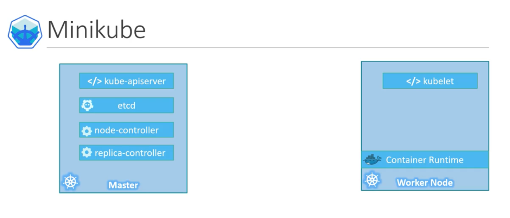
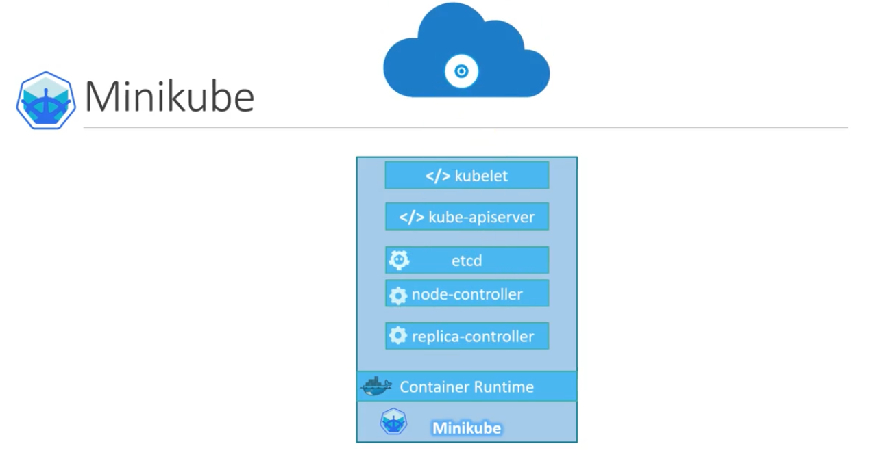
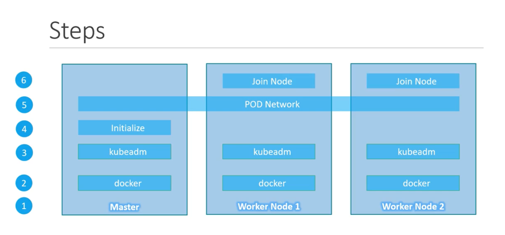

# Minikube Theory (Single Node k8 Cluster)

- Master Node consist of :- kube-apiserver, etcd, node-controller, replicas-controller
- Worker Node consist of :- kubelet, container-runtime
- 
- Minikube bundles all the various master and worker node components into single a image, providing us pre-configured single kubernetes cluster <-- This bundle as avaliable as .iso image
- Prequiste for Minikube set-up (Should be installed in ur host-machine)->
  - **Hypervisor** like VMWare or VirtualBox or in linux- Kernel Virtual Machine (KVM)
  - **Kubectl** (to intreact with k8 cluster)
  - **Minikube.exe**

---

## Kubectl + Miniube Installation in ubuntu-host

- (Basic Checks in host m/c) How to Check Virtualization is enabled in local machine -
  - In VirtualBox if you see 64bit of OS then Virtualization is enabled (or)
  - grep -E --color 'vmx|svm' /proc/cpuinfo (You should see vmx output)
- STEP TO INSTALL **Kubectl** [https://kubernetes.io/docs/tasks/tools/install-kubectl/]
  [https://kubernetes.io/docs/tasks/tools/install-kubectl-linux/]
  - \$ cd /home/tejas/tejas/other-apps
  - \$ mkdir k8
  - \$ curl -LO https://storage.googleapis.com/kubernetes-release/release/`curl -s https://storage.googleapis.com/kubernetes-release/release/stable.txt`/bin/linux/amd64/kubectl
  - \$ ll
  - \$ chmod +x ./kubectl
  - \$ ll
  - `\$ sudo mv ./kubectl /usr/local/bin/kubectl` (moving to -> /usr/local/bin)
  - \$ kubectl version --client
  - Enabling shell autocompletion :
    - `\$ type _init_completion` (To check if bash completion exist in machine)
    - \$ apt-get install bash-completion
    - \$ echo 'source <(kubectl completion bash)' >>~/.bashrc
    - \$ sudo -i (login as root)
    - \$ kubectl completion bash >/etc/bash_completion.d/kubectl
- STEP TO INSTALL **Hypervisor**
  - (I already installed VirtualBox, so no-need)
- STEP TO INSTALL **Minikube** via direct download (this will pull img and pull down into virtualbox mngr)
  - \$ cd /home/tejas/tejas/other-apps/k8
  - \$ curl -Lo minikube https://storage.googleapis.com/minikube/releases/latest/minikube-linux-amd64 \
    && chmod +x minikube
  - \$ ll
  - `\$ sudo mkdir -p /usr/local/bin/` (-p, --parents ==> no error if existing)
  - \$ sudo install minikube /usr/local/bin/
  - \$ cd /usr/local/bin/
  - \$ ll
  - Confirm Minikube Installation as a pod/img in Virtualbox
    - SYTNTAX: minikube start --driver=<driver_name>
    - `\$ minikube start --driver=virtualbox`
      (Since we are using VirtualBox, so see compelete list of drivers avaliable -> https://kubernetes.io/docs/setup/learning-environment/minikube/#specifying-the-vm-driver)
    - \$ minikube status
    - \$ minikube stop (To Stop Minikube)
    - (If you get Error -> machine does not exist) --then--> \$ minikube delete (delete minikube)
- Let us Play with running first hello-world _pod_ [REF- https://kubernetes.io/docs/setup/learning-environment/minikube/#quickstart]
  - `\$ minikube status` (Get status of your cluster)
  - `\$ minikube start` (Start ur cluster)
  - \$ kubectl get po -A
  - `\$ minikube dashboard` (to see in cluster in browser as GUI)
  - \$ kubectl get pod
  - `\$ kubectl create deployment hello-minikube --image=k8s.gcr.io/echoserver:1.4` (test-deployment on port 8080)
  - \$ kubectl get pod
  - `\$ kubectl expose deployment hello-minikube --type=NodePort --port=8080`
  - \$ kubectl get pod
  - \$ kubectl get services hello-minikube
  - `\$ minikube service hello-minikube --url` (Visit in browser)
  - \$ kubectl delete services hello-minikube (Delete this service)
  - \$ kubectl delete deployment hello-minikube
  - \$ minikube stop
- Ref:
  - https://minikube.sigs.k8s.io/docs/start/
  - https://kubernetes.io/docs/tasks/tools/install-kubectl-linux/
  - https://kubernetes.io/docs/tasks/tools/install-minikube/

---

# Kubeadm (Kube Admin Tool) Theory (Multi Node k8 Cluster)

- With **minikube** you can only set-up -> **Single Node Kubernetes Cluster** but with **Kubeadm** tool we can set-up **multiple node Cluster** with -> Master and worker on separate machine
- Configuring Steps:
  1. Create muliple VM's (or System/Servers)
  2. Designate One VM(or server) as Master node and other VM's as Worker Node
  3. Install container run time(i.e- Docker) on all the host/nodes
  4. Install Kubeadm tool in all the Nodes (kubeadm -> Bootstrap K8)
  5. Initialize Master Server (all the required components are installed in Master Node)
  6. Inorder to communicate b/w all master, worker(s) nodes -> Spun-up the POD Network (or Cluster Network)
  7. Join Worker nodes with -> Master node

---

# Configuring Steps (Kubeadm Practice) -

- [Configuring Steps](./kubeadm-config-steps.md)

---

# Using Play with k8 environment

- https://labs.play-with-k8s.com/
- Steps
  1.  Initializes cluster master node:
  - $ kubeadm init --apiserver-advertise-address $(hostname -i) --pod-network-cidr 10.5.0.0/16
  2.  Initialize cluster networking:
  - \$ kubectl apply -f https://raw.githubusercontent.com/cloudnativelabs/kube-router/master/daemonset/kubeadm-kuberouter.yaml
  3. (Optional) Create an nginx deployment:
  - \$ kubectl apply -f https://raw.githubusercontent.com/kubernetes/website/master/content/en/examples/application/nginx-app.yaml

---

# Setps to Setup Worker Node in Ubuntu Server - Assume Third (3rd) Worker Node

- VirtualBox > Right Click on Ubuntu Instance > Settings
- Adapter-1
  - Attached to: Bridge Adapter
  - Name: wlp3sO
  - Promiscuous Mode: Allow All
  - Ok
- Adapter-2
  - Attached to: Host-only Adapter
  - Name: vboxnet0
  - Ok
- System > Processor > 2
- Login into ubuntu VM (Rick VM)
- \$ ifconfig (note down the ipAddr to login from Host Machine SSH)
- `\$ systemctl status ssh*` (Check if SSH daemon is running)
- \$ ssh -l rick 192.168.0.111
- \$ cat /etc/hostname (Change hostname)
- \$ cat /etc/hosts
- \$ ifconfig (Check if you can see the host-only network adapter)
- \$ ifconfig enp0s8 192.168.99.13
- \$ nano /etc/network/interfaces (edit file as -> [.assets/networks-debian.sh])
